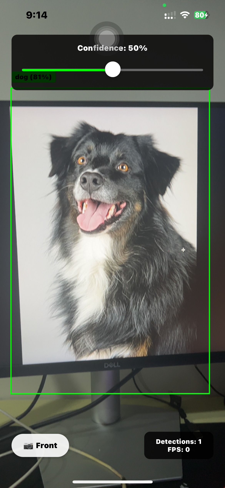

# React Native Object Detection App

A real-time object detection app built with React Native using VisionCamera and TensorFlow Lite. Detect 80+ objects in real-time with bounding boxes and confidence scores.

## ✨ Features

- 📱 Real-time object detection with live camera feed
- 🎯 Bounding boxes with confidence percentages
- 📷 Front/back camera switching
- ⚡ FPS monitoring and performance stats
- 🎚️ Adjustable confidence threshold (10-90%)
- 🏷️ 80+ object classes from COCO dataset

## 📱 Screenshots



*Real-time object detection with bounding boxes and confidence scores*

## 🚀 Quick Start

1. **Clone the repository**
   ```bash
   git clone https://github.com/yourusername/react-native-object-detection.git
   cd react-native-object-detection
   ```

2. **Install dependencies**
   ```bash
   npm install
   ```

3. **Run the app**
   ```bash
   # iOS
   npx expo run:ios
   
   # Android
   npx expo run:android
   ```

## 🛠️ Tech Stack

- **React Native 0.79.3** - Cross-platform mobile framework
- **Expo** - Development platform with prebuild workflow
- **VisionCamera** - Camera access and frame processing
- **TensorFlow Lite** - On-device ML inference
- **SSD MobileNet v1** - Pre-trained object detection model

## 🎯 How It Works

1. **Camera Feed**: Captures live video frames at 30 FPS
2. **Preprocessing**: Resizes frames to 300x300 pixels
3. **Inference**: Runs TensorFlow Lite model on each frame
4. **Postprocessing**: Filters detections by confidence threshold
5. **Rendering**: Draws bounding boxes with labels on screen

## ⚙️ Configuration

### Adjusting Performance
- **Confidence Threshold**: Use the slider in the app (10-90%)
- **Frame Processing**: Modify frame processor in `App.js`
- **Model Quality**: Replace with different TensorFlow Lite models

### Custom Models
1. Replace `models/ssd_mobilenet_v1.tflite` with your model
2. Update `models/labels.json` with corresponding class labels
3. Adjust input dimensions in the resize plugin if needed

## 📊 Performance

- **FPS**: Real-time processing at 15-30 FPS (device dependent)
- **Latency**: ~50-100ms inference time on modern devices
- **Memory**: Optimized for mobile with worklet-based processing

## 🐛 Troubleshooting

### Common Issues

**iOS build fails:**
```bash
npx expo prebuild --clean
npx expo run:ios
```

**Metro bundler issues:**
```bash
npx expo start --clear
```

**Low performance:**
- Reduce confidence threshold
- Lower camera quality preset
- Increase frame skip interval

## 📄 License

This project is licensed under the MIT License - see the [LICENSE](LICENSE) file for details.

## 🙏 Acknowledgments

- [VisionCamera](https://react-native-vision-camera.com/) for excellent camera integration
- [TensorFlow Lite](https://www.tensorflow.org/lite) for mobile ML capabilities
- [COCO Dataset](https://cocodataset.org/) for training data

---

⭐ **Star this repo if you found it helpful!**
